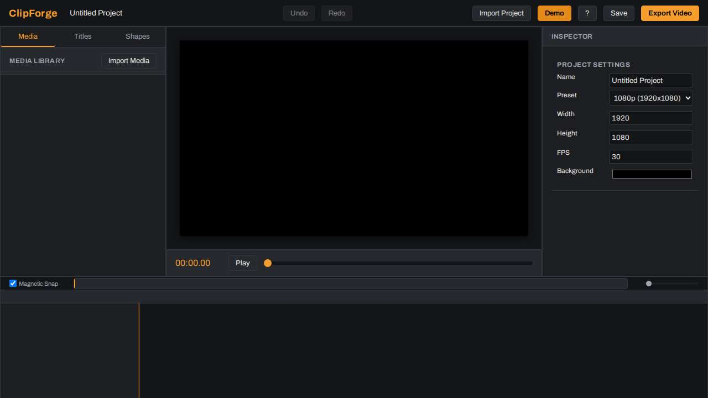
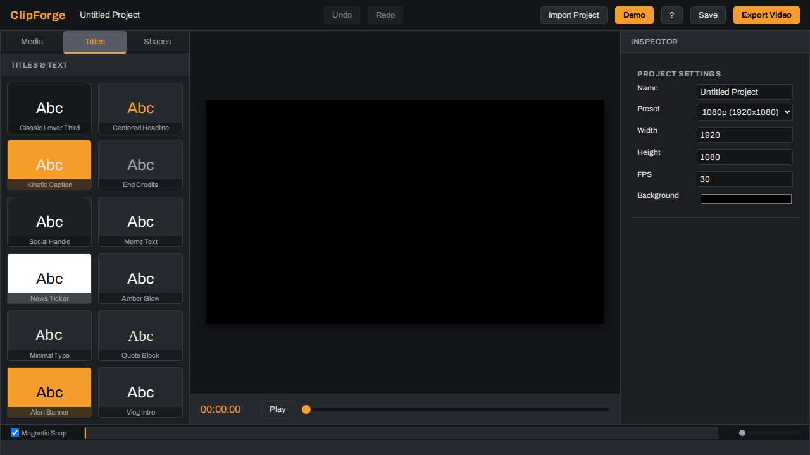
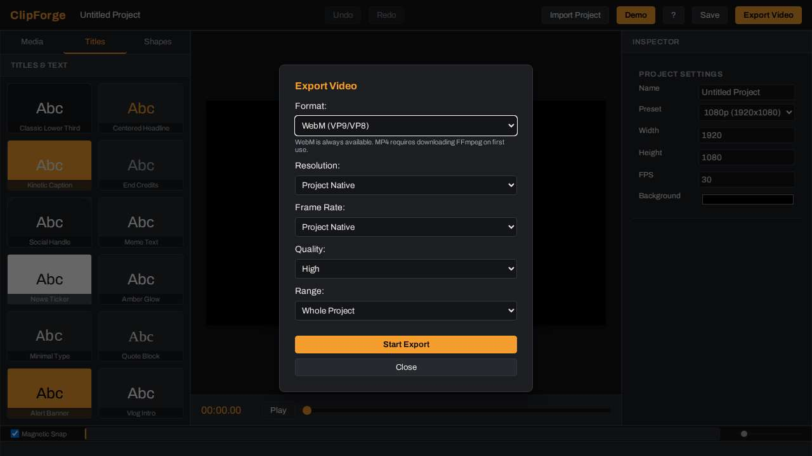

# ClipForge

**ClipForge** is a serious, fully client-side, web-based video editor. Think CapCut-web or iMovie class, running entirely in the browser, deployable on GitHub Pages. No build step, no framework, just pure ES modules and vanilla JavaScript.

## Features
- **Media Library:** Import video, audio, and images directly into the browser.
- **Timeline:** Multitrack drag & drop, snapping, zooming, split, trim, ripple delete, and undo/redo operations.
- **Transitions:** Crossfade and dip-to-black transitions between adjacent clips on the same track.
- **Inspector / Effects:** Transform clip properties (opacity, scale, rotation, x/y), apply keyframes to properties, add CSS-based visual effects (blur, contrast, brightness, hue-rotate), and adjust clip speed/audio.
- **Titles & Shapes:** Built-in animated title presets and basic graphical shapes.
- **Export Formats:**
  - **WebM:** Hardware-accelerated deterministic rendering via `canvas.captureStream` and `MediaRecorder` with offline WebAudio mixdown muxed in.
  - **MP4:** Fallback via in-browser FFmpeg.wasm.
  - **PNG:** Snapshot current frame.
  - **WAV:** Audio-only mixdown.

## Browser Support
| Browser | Core Editing | WebM Export | MP4 Export (FFmpeg.wasm) |
| --- | --- | --- | --- |
| **Chrome / Edge** | ✅ Full Support | ✅ Full Support | ✅ Supported (SharedArrayBuffer req) |
| **Firefox** | ✅ Full Support | ✅ Supported (vp8 fallback) | ⚠️ May require flags for SharedArrayBuffer |
| **Safari** | ✅ Full Support | ⚠️ Partial (Codec support varies) | ❌ Typically Unsupported |

## Screenshots

**Editor Timeline**


**Title Presets**


**Export Dialog**


## Development & Running

ClipForge is a completely client-side application with zero build steps. To run it locally:

1. Clone the repository.
2. Serve the directory with any static web server. For example:
   ```bash
   python3 -m http.server 8000
   ```
3. Open `http://localhost:8000` in your browser.

## Roadmap
- [x] **Wave 1:** Core platform, visual identity, state management, media library, playback engine, compositor, undo/redo, autosave.
- [x] **Wave 2:** Full Timeline UI (multitrack drag & drop, snapping, zooming).
- [x] **Wave 3:** Advanced Inspector & Effects (filters, transitions, keyframes).
- [x] **Wave 4:** Titles & Text Engine.
- [x] **Wave 5:** Export Module (WebCodecs / MediaRecorder rendering).
